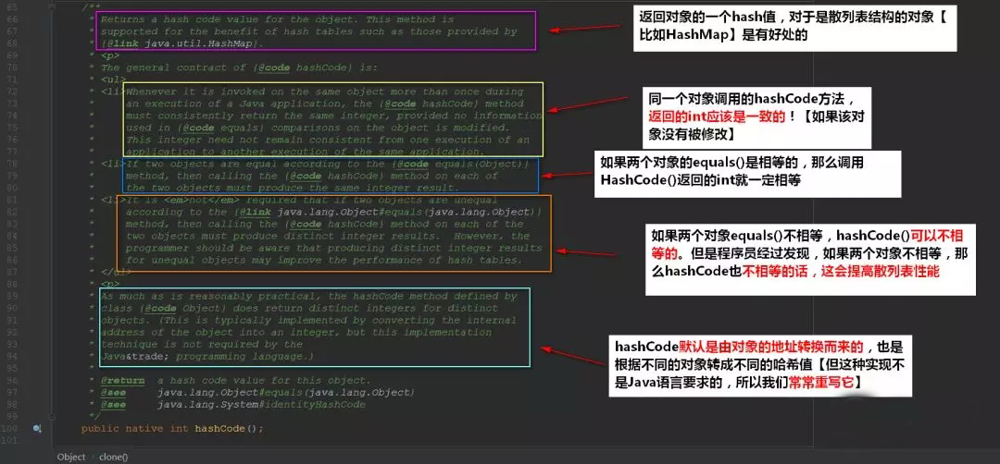

<span id = "0">

# Object类深入研究

- [Object类有哪些方法](#1)

- [hashCode](#2)

- [equals](#3)

- [toString](#4)

- [clone](#5)

- [wait & notify & notifyAll](#6)
- [finalize](#7)

<span id = "1">

<br/><br/>

- ### Object类有哪些方法

  > - registerNatives()【底层实现、不研究】
  > - hashCode()
  > - equals(Object obj)
  > - clone()
  > - toString()
  > - notify()
  > - notifyAll()
  > - wait(long timeout)【还有重载了两个】
  > - finalize()

  - Object一共有**11**个方法，其中一个为底层的实现`registerNatives()`，其中两个`wait()`和`wait(long timeout, int nanos)`重载方法。
  - 还有**一个属性**：返回字节码文件对象

<span>[回到顶部](#0)</span>

<span id = "2">

<br/><br/>

- ### hashCode

  > ```java
  > public native int hashCode();
  > ```
  >
  > 由native方法底层实现了

<span>[回到顶部](#0)</span>

<span id = "3">

<br/><br/>

- ### equals

  > ```java
  > public boolean equals(Object obj) {
  > 	return (this == obj);
  > }
  > ```
  > 直接判断内存地址了
  - 想要更加清晰它们究竟是做什么的，我们来读读它的注释：
  
  
  - 根据注释我们可以总结以下的要点：
  > - 重写`equals()`方法，就必须重写`hashCode()`的方法
  >
  > - `equals()`方法默认是比较对象的地址，使用的是`==`等值运算符
  >
  > - `hashCode()`方法对底层是散列表的对象有提升性能的功能
  >
  > - 同一个对象(如果该对象没有被修改)：那么重复调用`hashCode()`那么返回的int是相同的！
  >
  > - `hashCode()`方法默认是由对象的地址转换而来的
  >
  > - `equals()`方法还有5个默认的原则：
  >
  > - - 自反性--->调用`equals()`返回的是true，无论这两个对象谁调用`equals()`都好，返回的都是true
  >   - 一致性--->只要对象没有被修改，那么多次调用还是返回对应的结果！
  >   - 传递性--->`x.equals(y)`和`y.equals(z)`都返回true，那么可以得出：`x.equals(z)`返回true
  >   - 对称性--->`x.equals(y)`和`y.equals(x)`结果应该是相等的。
  >   - 传入的参数为null，返回的是false

  - 为啥说`hashCode()`以散列表为底层带来性能的提升是很容易理解的。我们再来**回顾**一下HashMap的插入：

    

  - 如果hash值都不相等，那么可以直接判断该key是不相等的了！

<span>[回到顶部](#0)</span>

<span id = "4">

<br/><br/>

- ### toString

  - toString方法主要是用来**标识**该对象的
  - 

<span>[回到顶部](#0)</span>

<span id = "5">

<br/><br/>

- ### clone

  > - clone方法用于对象的克隆，一般想要克隆出的对象是**独立**的(与原有的对象是分开的)
  > - 深拷贝指的是该对象的成员变量(如果是可变引用)都应该克隆一份，浅拷贝指的是成员变量没有被克隆一份
  > - 如何克隆对象？
  >   - 克隆的对象要**实现Cloneable接口**
  >   - **重写clone方法**，最好修饰成public

<span>[回到顶部](#0)</span>

<span id = "6">

<br/><br/>

- ### wait & notify & notifyAll

  wait和notify方法其实就是Java给我们提供让**线程之间通信**的API。

  > - 无论是wait、notify还是notifyAll()都需要**由监听器对象(锁对象)来进行调用**
  >
  > - - 简单来说：**他们都是在同步代码块中调用的**，否则会抛出异常！
  >
  > - `notify()`唤醒的是在等待队列的**某个**线程(不确定会唤醒哪个)，`notifyAll()`唤醒的是等待队列**所有**线程
  >
  > - 导致`wait()`的线程被唤醒可以有4种情况
  >
  > - - 该线程被中断
  >   - `wait()`时间到了
  >   - 被`notify()`唤醒
  >   - 被`notifyAll()`唤醒
  >
  > - 调用`wait()`的线程会**释放掉锁**

  - **为什么wait和notify在Object方法上**

    > - 因为我们的**锁是对象锁**【要是忘记的同学可回顾：[Java锁机制了解一下](https://mp.weixin.qq.com/s?__biz=MzI4Njg5MDA5NA==&mid=2247484198&idx=1&sn=4d8e372165bb49987a6243f17153a9b4&chksm=ebd74227dca0cb31311886f835092c9360d08a9f0a249ece34d4b1e49a31c9ec773fa66c8acc&scene=21#wechat_redirect)】，每个对象都可以成为锁。**让当前线程等待某个对象的锁，当然应该通过这个对象来操作了**
    > - 锁对象是**任意**的，所以这些方法必须定义在Object类中

  - **Thread.sleep()`与`Object.wait()**

    > 二者都可以暂停当前线程，释放CPU控制权。
    >
    > - 主要的区别在于`Object.wait()`在释放CPU同时，**释放了对象锁的控制**。
    > - 而`Thread.sleep()`没有对锁释放

  - **但是要注意的是:**

    > notify方法调用后，被唤醒的线程**不会立马获得到锁对象**。而是等待notify的synchronized代码块**执行完之后**才会获得锁对象

<span>[回到顶部](#0)</span>

<span id = "7">

<br/><br/>

- ### finalize

  - finalize()`方法将在**垃圾回收器清除对象之前调用**，但该方法不知道何时调用，具有**不定性**

    > 一般我们都不会重写它~

  - 一个对象的finalize()方法**只会被调用一次**，而且finalize()被调用不意味着gc会立即回收该对象，所以有可能调用finalize()后，该对象又不需要被回收了，然后到了真正要被回收的时候，因为前面调用过一次，所以不会调用finalize()，产生问题。

